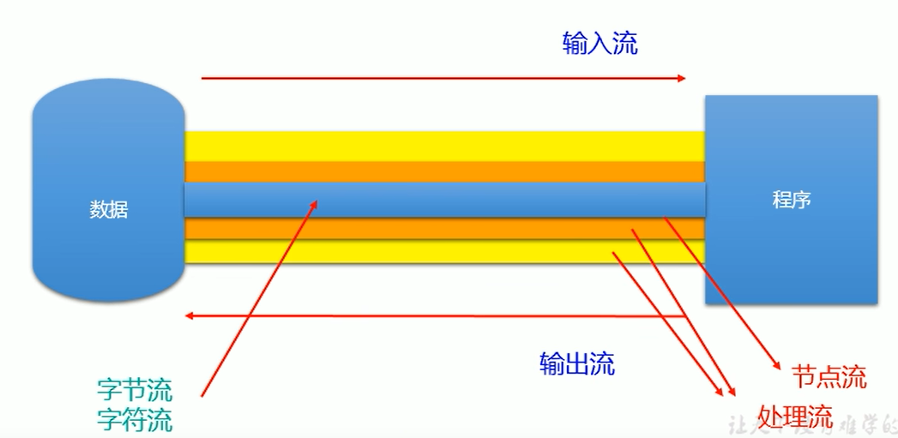
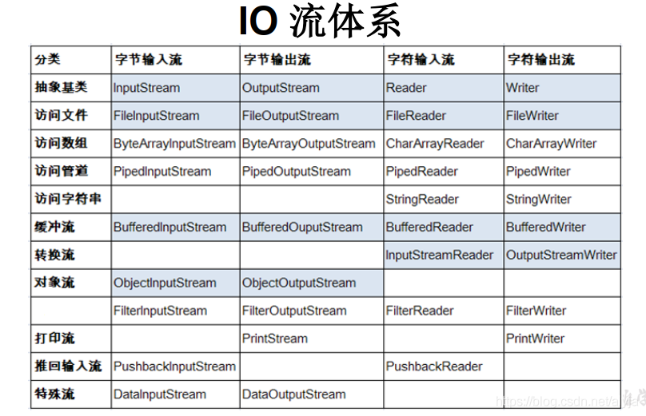
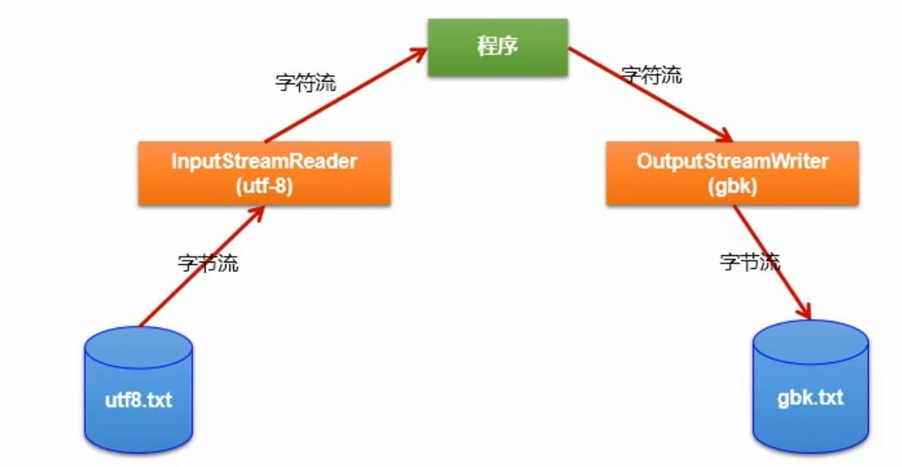

# Java SE

## 一、类

### 1.1 隐式参数和显示参数
实例代码：
```java
public void raiseSalary(double byPercent) {
	double raise = salary * byPercent / 100;
	salary += raise;
}
```
其中方法`raiseSalary`有两个参数，一个是**显示参数**，即方法名后括号类的`byPercent`变量；另一个是**隐式参数**，是该方法所属的对象，也可能是出现在方法名前面的对象，例如`x.f(args)`中x就是隐式参数，用关键值`this`来表示，因此上述代码可写成下面这种形式将实例字段和局部变量区别开来
```java
public void raiseSalary(double byPercent) {
	double raise = this.salary * byPercent / 100;
	this.salary += raise;
}
```


### 1.2 getter方法使用注意事项

**不要编写*返回可变对象（即放回对象自带setter方法）引用的访问器方法**，例如如下Employee类

```java
class Employee {
    private Date hireDay;
    
    public Date getHireDay() {
        return hireDay;
    }
}
```

其中`Date`类中有一个setter方法`setTime()`，可以设置毫秒数。从getter方法返回的Date对象和Employee对象中的Date对象引用同一个Date对象，故如何调用返回的Date对象中的`setTime()`方法，会造成Employee对象中所引用的Date方法对应的属性值发生改变，严重破坏了类的封装性


### 1.3 静态字段

如果将一个字段定义为static，每个**类**（注意是类不是对象）只有一个这样的字段。对于非静态的实例字段，每个对象都有自己的一个副本，例如下面示例代码：

```java
public class Employee {

    private static int nextId = 1;

    private int id;

    public Employee() {
        setId();
    }

    public void setId() {
        id = nextId++;
    }

    public int getId() {
        return this.id;
    }
}
```

每个Employee对象都会有一个自己的`id`字段，但是这些对象共享同一个`nextId`字段。也就是如果有1000个Employee对象，它们的id字段值可以有1000种不同的值，但是所有对象的`nextId`的值都是相同的。即使没有Employee对象，静态字段`nextId`也存在。**静态字段属于类，不属于任何单个的对象**


### 1.4 类和对象的初始化顺序

+ 类的初始化
  + 首先初始化其父类的static字段和static块
  + 初始化该类的static字段或者static块
+ 子类构造函数（第一行默认调用super()来调用父类构造函数，故需要跳到第三步）

+ 父类构造函数
+ 继续子类的构造函数


### 1.5 类之间的关系

+ 依赖（use-a）
  + 如果一个类的方法使用或者操纵了另一个类的对象，我们说一个类依赖于另一个类
  + 竟可能减少相互依赖的类，从而减少类之间的耦合
+ 聚合（has-a）
  + 一个类包含了另一个类对象
+ 继承（is-a）


## 二、继承

### 2.1 对象方法调用的过程

假设要调用`x.f(args)`，隐式参数x声明为类C的一个对象

#### 2.1.1 编译器查看对象的声明类型和方法名。

需要注意的是：有可能存在多个方法名称相同但参数类型不一样的方法，例如存在方法`f(int)`和`f(String)`。编译器会一一列举出类中所有名为`f`的方法**和其父类**中所有名为f的**可访问(非私有方法)的方法**

#### 2.1.2 编译器确定方法调用提供的参数类型

如果在所有名为f的方法中存在一个与所提供的参数类型完全匹配的方法，就选择这个方法，这个过程称为**重载解析**（overloading resolution）。如果编译器没有找到与参数类型匹配的方法，或者发现经过类转型后有多个方法与之匹配，编译器就会报告一个错误

#### 2.1.3 绑定

如果是private方法、static方法、final方法或者构造器，那么编译器可以准确地知道应该调用哪个方法，这称为**静态绑定**（static binding）。与此对应的是，如果要调用的方法依赖于隐式参数的实际类型（也就是对象所属的类，例如Employee对象属于Employee类），那么必须在运行时使用动态绑定（dynamic binding），即在运行时能够自动地选择适当的方法

#### 2.1.4 

程序运行并蚕蛹动态绑定的调用方法时，虚拟机必须调用与x所应用对象的实际类型对应的那个方法。假设x的实际类型是D，它是C类的子类。如果D类定义了方法`f(String)`，就会调用这个方法；否则，将在D类的父类中寻找`f(String)`，以此类推


> 注：
>
> 每次调用方法都要完成这个搜索，时间开销相当大。因此，虚拟机预先为每个类计算了一个方法表（method table），其中列出了所有方法的签名和要调用的实际方法。这样一来，在真正调用方法的时候，虚拟机仅查找这个表就行了。
>
> 例如，虚拟机搜索D类的方法表，寻找与调用`f(String)`相匹配的方法。这个方法既有可能是`D.f(String)`，也有可能是`X.f(String）`，这里的X是D的某个超类。如果调用的是`super.f(param)`，那么编译器将对隐式参数父类的方法进行搜索


### 2.2 覆盖方法注意事项

在覆盖一个方法的时候，子类方法的可见性**不能低于**父类方法所对应方法的可见性。例如父类方法中是public，子类方法也必须是public


### 2.3 final类和方法

#### 2.3.1 final类

如果希望某个类无法被继承，可以使用final修饰符修饰类，例如

```java
public final class Executive extends Manager {
    
}
```

此时Executive类无法被其他子类继承

#### 2.3.2 final方法

如果类中某个特定方法不想让子类覆盖，可以将其声明为final，例如

```java
public class Employee {
    public final String getName() {
    	return name;
    }
}
```


### 2.4 父类强制转换成子类之前，需要使用instanceof进行检查

例如对于下面程序

```java
Manager boss = new Manager("Carl Cracker", 80000, 1987, 12, 15);
boss.setBonus(5000);

Employee[] employees = new Employee[3];

employees[0] = boss;
employees[1] = new Employee("Harry Hacker", 50000, 1989, 10, 1);
employees[2] = new Employee("Tommy Tester", 40000, 1990, 3, 15);
```

如果要将employees[0]强转回Manager类型，需要使用instanceof进行检查

```java
if (employees[0] instanceof Manager) {
    boss = (Manager) staff[1];
}
```


### 2.5 抽象类注意事项

+ 抽象类既可以包含抽象方法，也可以包含字段和具体方法

+ 扩展抽象类可以有两种选择

  + 在子类中保留抽象类中的部分或所有抽象方法仍未定义，这样必须将子类也标记为抽象类
  + 在子类中定义全部的方法，这样子类就不需要标记为抽象方法了

+ 抽象类**不能实例化**，也就是说如果将一个类声明为`abstract`，就不能创建这个类的对象（即new一个抽象类对象）

+ 可以创建抽象类的对象变量，但是这样一个变量**只能**引用非抽象子类的对象，例如抽象类Person有一个非抽象子类对象Student

  ```java
  Person p = new Student("Vince Vu", "Economics");
  ```


### 2.6 访问控制修饰符

+ private - 仅对本类可见
+ public - 对外部完全可见
+ protected - 对本包和所有子类可见
+ 默认（不需要修饰符）- 对本包可见


### 2.7 多态

我们在编译期，只能调用父类中声明的方法，但在运行期，我们实际执行的是子类重写父类的方法。


#### 示例1

```java
class Base {
	int count = 10;

	public void display() {
		System.out.println(this.count);
	}
}

class Sub extends Base {
	int count = 20;

	public void display() {
		System.out.println(this.count);
	}
}

public class FieldMethodTest {
	public static void main(String[] args) {
		Sub s = new Sub();
		System.out.println(s.count);//20
		s.display();//20
		
		Base b = s;//多态性
		//==：对于引用数据类型来讲，比较的是两个引用数据类型变量的地址值是否相同
		System.out.println(b == s);//true
		System.out.println(b.count);//10
		b.display();//20
	}
}
```


若子类重写了父类方法，就意味着子类里面定义的方法彻底覆盖了父类里的同名方法，系统将不可能把父类里的方法转移到子类中：编译看左边，运行看右边

**对于实例变量则不存在这样的现象，即使子类里定义了与父类完全相同的实例变量，这个实例变量依然不可能覆盖父类中定义的实例变量：编译运行都看左边**


## 三、 接口

### 3.1 接口的属性

+  接口的方法始终是public，故可以省略public声明
+ 接口中的字段始终是public static final

### 3.2 克隆

#### 3.2.1 浅克隆

如果对象的成员变量是基本数据类型，则拷贝它的值到新的对象中；如果是引用类型，则共享同一个引用对象

实现方法是直接调用Objects类中的clone()方法，具体步骤如下 

+ 实现`Cloneable`接口
+ 将`clone()`方法重新定义为public（如果是原来的protected，在其他包下，无法使用对象的`clone()`方法）
+ 调用`super.clone()`

示例代码：

```java
class Employee implements Cloneable {
    public Employee clone() throws CloneNotSupportedException {
        return (Employee) super.clone();
    }
}
```


#### 3.2.1 深克隆

和浅克隆相比，除了拷贝基本变量的值，对于引用对象，也会重新生成一个新的引用对象，不会和原来的被克隆对象共享同一个引用对象


和浅克隆的实现相比，需要将类中的引用对象也克隆一份，示例代码如下：

```java
class Employee implements Cloneable {
    public Employee clone() throws CloneNotSupportedException {
        Employee cloned = (Employee) super.clone();
        
        cloned.hireDay = (Date) hireDay.clone();
        
        return cloned;
    }
}
```

其中hireDay也是引用对象，故需要重新克隆一份


## 四、异常

### 4.1 异常分类

所有的异常对象都是继承Throwable类的一个类实例


Throwable

+ Error：描述了Java运行时系统的内部错误和资源耗尽错误
+ Exception
  + RuntimeException：如果出现RuntimeException，那么一定是你的问题
    + 错误的强制类型转换
    + 数组访问越界
    + 访问null指针
  + 其他异常
    + IOException
      + 试图超越文件末尾继续读取数据
      + 试图打开一个不存在的文件
      + 试图根据给定的字符串查找Class对象，而这个字符串表示并不存在
    + ...


其中Error类和RuntimeException类的所有异常称为**非检查型（unchecked）异常**，所有其他的异常称为**检查型（checked）异常**。编译器会检查你是否为所有的检查型异常提供了异常处理器


### 4.2 抛出异常的情况

下面4中情况会抛出异常

+ 调用了一个抛出检查型异常的方法
+ 检查到一个错误，并且利用throw语句抛出一个检查型异常
+ 程序出现错误，例如 `a[-1]=0` 会抛出一个非检查型异常
+ Java虚拟机或运行时库出现内部错误（从Error继承的异常）


> 注：
>
> 如果出现前两种情况，则必须告诉调用这个方法的程序员有可能抛出异常
>
> 也就是说，一个方法必须声明所有可能抛出的检查型异常，而非检查异常要么在控制之外（例如Error），要么是从一开始就应该避免的情况所导致的（例如RuntimeException）
>
> 如果方法没有声明所有可能发生的检查型异常，编译器就会发出一个错误消息


### 4.3 异常处理规则

如果编写的一个方法覆盖了父类的方法，而这个父类的方法没有抛出异常，你就必须捕获（try-catch）你的方法代码中出现的每一个检查型异常。也就是说，不允许在子类的throws说明符中出现父类方法未列出的异常类


## 五、泛型

### 5.1 定义泛型类

需要引入一个类型变量T，用尖括号`<>`括起来，并且放在类名的后面，示例代码

```java
public class Pair<T> {

    private T first;

    private T second;

    public Pair() {
        first = null;
        second = null;
    }

    public Pair(T first, T second) {
        this.first = first;
        this.second = second;
    }

    public T getFirst() {
        return first;
    }

    public T getSecond() {
        return second;
    }

    public void setFirst(T first) {
        this.first = first;
    }

    public void setSecond(T second) {
        this.second = second;
    }
}
```


当然，也可以有多个类型变量，例如可以这样定义泛型类Pair

```java
public class Pair<T, U> {
    ...
}
```

这样T和U可以是两个不同的类型


> 注：
>
> 如果定义了泛型类，但是实例化的时候没有指定具体的泛型类型，则认为此泛型类型为Object，例如直接`new Pair()`而不是new `Pair<String>()`的形式创建实例化对象，其中的成员变量first和second会变成Object类型


### 5.2 泛型类的继承

#### 5.2.1 继承时指明了父类的泛型类型

如果子类继承泛型父类，并且指明了父类泛型类型，那么实例化子类对象时，不再需要致命子类对象的泛型，例如

```java
public class SubPair extends Pair<String> {
    ...
} 
```

此时实例化`SubPair`对象的时候，不需要在指定泛型，此时SubPair不再是泛型类，变成一个普通的类

```java
SubPair pair = new SubPair();
```


#### 5.2.2 继承时未指明父类的泛型类型

如果子类继承泛型父类，但是并没有指定泛型类型，那么子类依然是泛型类

```java
public class SubPair<T> extends Pair<T> {
    ...
} 
```


> 注：
>
> **在泛型类中**，不能定义带有泛型的静态方法，因为静态方法的创建早于对象的创建，而指定泛型需要在创建对象的时候才能指定
>
> 不是泛型类的类中可以创建带有泛型的静态方法


### 5.3 泛型擦除

**泛型擦除**是指Java中的泛型只在编译期有效，在运行期间会被删除。也就是说所有泛型参数在编译后都会被清除掉。

```typescript
public class Foo {  
    public void listMethod(List<String> stringList) {  
    }  
    
    public void listMethod(List<Integer> intList) {  
    }  
}  
```

上面这段代码编译时会报方法重载错误，原因是上面两个方法的参数是泛型参数，在编译后会被泛型擦除，最后两个方法都会是 `public void listMethod(List intList)`，所以会报重载错误的。

在编译器编译后，泛型的转换规则如下：

- List、List 擦除后的类型为 List；
- List[]、List[] 擦除后的类型为 List[]；
- List<? extends E>、List<? super E> 擦除后的类型为 List；
- List<T extends Serialzable & Cloneable> 擦除后类型为 List。

有了上面的泛型擦除知识后，我们就可以理解下面的现象了：

+ 泛型类的class对象相同

```typescript
public static void main(String[] args) {  
    List<String> ls = new ArrayList<String>();  
    List<Integer> li = new ArrayList<Integer>();  
    System.out.println(ls.getClass() == li.getClass());  
}  
```

+ 不能对泛型数组进行初始化

```javascript
List<String>[] list = new List<String>[];   // XXX
```

### 5.4 泛型方法

#### 5.4.1 创建泛型方法

**类型变量（T）需要放在修饰符的后面，并在返回类型的前面**，示例代码如下

```java
public class ArrayAlg {
    public static <T> T getMiddle(T... a) {
        return a[a.length / 2];
    }
}
```

#### 5.4.2 类型变量的限定

如果要计算数组中的元素，可以这样编写方法代码：

```java
public class ArrayAlg {
    public static <T> T min(T[] a) {
        if (a == null || a.length == 0) {
            return null;
        }

        T smallest = a[0];

        for (int i = 1; i < a.length; ++i) {
            if (smallest.compareTo(a[i]) > 0) {
                smallest = a[i];
            }
        }

        return smallest;
    }
}
```

但这样会报错，因为使用compareTo方法的对象必须实现了Comparable接口，故这里必须对类型变量T做出限定，方法体变成了如下代码

```java
 public static <T extends Comparable> T min(T[] a) {
     ...
 }
```

这样规定了方法min只能在实现了Comparable接口的类的数组上调用


如果要加多个限定，可以用`&`分隔符分隔：

```java
T extends Comparable & Serializable
```


> 注：
>
> 这里使用extends关键字，不是implements关键字


### 5.5 通配符类型

#### 5.5.1 上界通配符（通配符的子类型限定）

在泛型类型中，不管S和T有什么样的关系，泛型Pair\<S\>和Pair\<T\>都没有任何关系


在通配符类型中，可以允许类型参数发生变化，例如

```java
Pair<? extends Employee>
```

表示任何任何类型参数是Employee子类和Employee类型的泛型类型，例如`Pair<Manager>`符合，但是`Pair<String>`不是，因为String不是Employee的子类

此时`Pair<Manager>`是`Pair<? extends Employee>`


示例代码：

```java
public class GenericsUpperBoundedWildcardDemo {
    public static double sumOfList(List<? extends Number> list) {
        double s = 0.0;
        for (Number n : list) {
            s += n.doubleValue();
        }
        return s;
    }

    public static void main(String[] args) {
        List<Integer> li = Arrays.asList(1, 2, 3);
        System.out.println("sum = " + sumOfList(li));
    }
}
// Output:
// sum = 6.0
```


#### 5.5.2 下界通配符（通配符的超类型限定）

在通配符限定中可以指定一个超类型限定（supertype bound），例如

```java
Pair<? super Manager>
```

表示所有Manager的超类型（父类型）以及Manager类型，例如`Pair<Employee>`符合（Employee是Manager的父类）


示例代码

```java
public class GenericsLowerBoundedWildcardDemo {
    public static void addNumbers(List<? super Integer> list) {
        for (int i = 1; i <= 5; i++) {
            list.add(i);
        }
    }

    public static void main(String[] args) {
        List<Integer> list = new ArrayList<>();
        addNumbers(list);
        System.out.println(Arrays.deepToString(list.toArray()));
    }
}
// Output:
// [1, 2, 3, 4, 5]
```


#### 5.5.3 无界通配符

无界通配符有两种应用场景：

- 可以使用 Object 类中提供的功能来实现的方法。
- 使用不依赖于类型参数的泛型类中的方法。

语法形式：`<?>`

```java
public class GenericsUnboundedWildcardDemo {
    public static void printList(List<?> list) {
        for (Object elem : list) {
            System.out.print(elem + " ");
        }
        System.out.println();
    }

    public static void main(String[] args) {
        List<Integer> li = Arrays.asList(1, 2, 3);
        List<String> ls = Arrays.asList("one", "two", "three");
        printList(li);
        printList(ls);
    }
}
// Output:
// 1 2 3
// one two three
```


如果在集合中用`?`来创建集合，那么即使将一个例如String类型的集合引用赋值给它，它**不能集合中添加任何值，除了`null`**，但是可以读取数据，获得的数据类型为Object

```java
List<?> list = null;

List<String> list2 = new ArrayList<>();
list2.add("A");
list2.add("B");

list = list2;
list.add("B"); // 报错
list.add(null);

Object o = list.get(0);
```


## 六、集合

### 6.1 动态数组选择

动态数组可以选择ArrayList和Vector两种，其中Vector是**同步的**，可以安全的从两个线程访问同一个Vector对象。

但是，如果只从一个线程访问Vector，代码就会在同步操作上白白浪费大量的时间；ArrayList与之相反，它的方法是不同步的，因此在不需要同步时使用ArrayList，而不要使用Vector

### 6.2 Map键值获取

+ Set\<Map.Entry\<K, V\>\> entrySet()
  + 返回Map.Entry对象，其中包含了Map中的键值对的集合视图

+ Set\<K\> keySet()
  + 返回映射中所有键的一个集合视图
+ Collection\<V\> values()
  + 返回映射中所有值的一个集合视图


## 七、IO流

### 7.1 File类概述

File类是java.io包下的类

File类的一个对象，代表一个文件或者一个文件目录


### 7.2 File类构造方法

| Constructor                         | Description                                                  |
| :----------------------------------: | :----------------------------------------------------------- |
| `File(File parent, String child)`   | Creates a new `File` instance from a parent abstract pathname and a child pathname string. |
| `File(String pathname)`             | Creates a new `File` instance by converting the given pathname string into an abstract pathname. |
| `File(String parent, String child)` | Creates a new `File` instance from a parent pathname string and a child pathname string. |
| `File(URI uri)`                     | Creates a new `File` instance by converting the given `file:` URI into an abstract pathname. |

> 注：其中`File(String pathname)`中`pathname`使用相对路径，是相对于当前module的位置，不是当前类所在的位置


路径分隔符：

+ windows和DOS系统下默认使用`\`来表示
+ UNIX和URL使用`/`表示

为了解决在不同系统下分隔符不同，File类提供了一个常量根据系统动态的提供分隔符`public static final String separator`，例如

```java
File file1 = new File("D:\\ecifics\\hello.txt");
File file2 = new File("D:" + File.separator + "ecifics" + File.separator + "hello.text");
```


### 7.3 File类的常用方法

| Modifier And Type | Method | Description |
| :-------: | :-------------------: | :------------------------------------------------------------ |
| `String` | `getAbsolutePath()` | Returns the absolute pathname string of this abstract pathname. |
|`String` |`getName()`|	Returns the name of the file or directory denoted by this abstract pathname.|
|`String` |`getPath()`| Converts this abstract pathname into a pathname string. |
|`String`|`getParent()`|Returns the pathname string of this abstract pathname's parent, or null if this pathname does not name a parent directory.|
|`long`|`length()`|	Returns the length of the file denoted by this abstract pathname.|
|`long`|`lastModified()`|Returns the time that the file denoted by this abstract pathname was last modified.|
|`String[]`|`list()`|Returns an array of strings naming the files and directories in the directory denoted by this abstract pathname.|
|`File[]`|`listFiles()`|Returns an array of abstract pathnames denoting the files in the directory denoted by this abstract pathname.|


```java
@Test
public void test2() {
    File file = new File("file" + File.separator + "hello.text");

    System.out.println(file.getAbsolutePath());
    System.out.println(file.getPath());
    System.out.println(file.getName());
    System.out.println(file.getParent());
    System.out.println(file.length());
    System.out.println(new Date(file.lastModified()));
}
```

 

输出结果

```java
D:\Java\Project\JavaSE\file\hello.text
file\hello.text
hello.text
file
7
Sun May 01 09:35:44 CST 2022
```


### 7.4 IO流概述

流是一种抽象概念，它代表了数据的无结构化传输。`IO` 流对应的就是 `InPut` 和 `Output`，也就是输入和输出。输入和输出这个概念是针对于应用程序而言，比如当前程序中需要读取文件中的内容，那么这就是输入，而如果需要将应用程序本身的数据发送到其他应用，就对应了输出。


### 7.5 IO流的分类

- 按操作数据单位不同分为：字节流(8 bit，用于传输音视频)，字符流(16 bit，用于传输文本文件)
- 按数据流的流向不同分为：输入流，输出流
- 按流的角色的不同分为：节点流，处理流（作用在已有的流之上，装饰者模式，例如缓冲流）



|抽象基类|字节流|字符流|
|:---:|:---:|:---:|
|输入流|InputStream|Reader|
|输出流|OutputStream|Writer|


**流的体系结构**



从上图可以看出，字节流是以Stream为后缀的，而字符流是以Reader或者Writer为后缀的


### 7.6 IO流使用步骤以及异常处理

使用步骤

+ File类的实例化
+ 流的实例化
+ 流的相关操作
+ **流的关闭**


异常处理

+ 流使用完之后要用其`close()`方法对其进行关闭

+ 要将流的实例化放在try-catch中，因为如果直接抛出异常，流无法关闭，因此需要将实例化以及相关操作放在try-catch中，而将流的关闭放在`finally`中，并且在关闭之前要检查要关闭的流是否为`null`
+ 读入的文件一定要存在，不然会报`FileNotFoundException`
+ 如果要关闭多了流，需要在使用多个try-catch语句，每个try-catch语句中关闭一个流


### 7.7 字符流-用于处理文本文件等字符类型数据

#### 7.7.1 读入数据-FileReader

使用`read()`读取工程目录下file目录下的hello.txt文件中的文本

```java
public class FileReaderWriterTest {

    @Test
    public void testFileReader() {
        // 1.实例化File类对象，指明要操作的文件
        File file = new File("file" + File.separator + "hello.txt");
        FileReader fileReader = null;

        try {
            // 2.操作具体的流
            fileReader = new FileReader(file);

            // 3. 数据的获取, Read()方法返回值：The character read, or -1 if the end of the stream has been reached
            int data = fileReader.read();

            while (data != -1) {
                System.out.print((char) data);
                data = fileReader.read();
            }
        } catch (IOException e) {
            e.printStackTrace();
        } finally {
            try {
                // 4.流的关闭
                if (fileReader != null) {
                    fileReader.close();
                }
            } catch (IOException e) {
                e.printStackTrace();
            }
        }
    }
}
```


使用`reader(char[] cbuf)`读取工程目录下file目录下的hello.txt文件中的文本

```java
public class FileReaderWriterTest {

    @Test
    public void testFileReaderOverride() {
        // 1.实例化File类对象，指明要操作的文件
        File file = new File("file" + File.separator + "hello.txt");
        FileReader fileReader = null;

        try {
            // 2.创建流
            fileReader = new FileReader(file);

            // 3.流相关的操作
            char[] cbuf = new char[5];
            int len;
            while ((len = fileReader.read(cbuf)) != -1) {
                for (int i = 0; i < len; i++) {
                    System.out.print(cbuf[i]);
                }
            }
        } catch (IOException e) {
            e.printStackTrace();
        } finally {
            // 4.关闭流
            try {
                if (fileReader != null) {
                    fileReader.close();
                }
            } catch (IOException e) {
                e.printStackTrace();
            }
        }
    }
}
```

> 注：read(char[] cbuf)实际上使用读取到的结果覆盖原来的cbuf数组，如果返回的结果长度小于了cbuf数组的长度，那么如果读取cbuf的全部数据，后面部分可能是之前的数据，故遍历cbuf 的数组长度不应该超过read(char[] cbuf)的返回值


#### 7.7.2 输出数据-FileWriter

向目标文件输出相关的字符

输出操作的目标文件对象，如果不存在，在输出的过程中会自动创建；如果存在，会用输出内容覆盖文本文件原来的内容

如果想在文件末尾添加输出的内容，可以在FileWriter构造方法`public FileWriter(File file, boolean append)`中将第二个参数位置设置为true(if true, then bytes will be written to the end of the file rather than the beginning)

```java
public class FileReaderWriterTest {

    @Test
    public void testFileWriter() {
        // 1.实例化File对象
        File file = new File("file" + File.separator + "writer.txt");
        FileWriter fileWriter = null;

        try {
            // 2.创建流的对象
            fileWriter = new FileWriter(file);
            
            // 3.流的相关操作
            fileWriter.write("I have a dream!\n");
            fileWriter.write("I also have a dream!");
        } catch (IOException e) {
            e.printStackTrace();
        } finally {
            try {
                // 4.关闭流
                if (fileWriter != null) {
                    fileWriter.close();
                }
            } catch (IOException e) {
                e.printStackTrace();
            }
        }
    }
}
```


#### 7.7.3 FileWriter和FileReader小练习

目标：将源文件中的文本信息写入到目标文件中去

```java
public class FileReaderWriterTest {

    @Test
    public void testFileReaderWriter() {
        // 1.创建File类实例化对象
        File srcFile = new File("file" + File.separator + "hello.txt");
        File destFile = new File("file" + File.separator + "hello2.txt");

        FileWriter fileWriter = null;
        FileReader fileReader = null;

        try {
            // 2.实例化流对象
            fileReader = new FileReader(srcFile);
            fileWriter = new FileWriter(destFile);

            // 3.流的相关操作，将目标文件中的文本写入对应的文件中去
            char[] cbuf = new char[5];
            int len;
            while ((len = fileReader.read(cbuf)) != -1) {
                fileWriter.write(cbuf, 0, len);
            }
        } catch (IOException e) {
            e.printStackTrace();
        } finally {
            try {
                if (fileReader != null) {
                    fileReader.close();
                }
            } catch (IOException e) {
                e.printStackTrace();
            }

            try {
                if (fileWriter != null) {
                    fileWriter.close();
                }
            } catch (IOException e) {
                e.printStackTrace();
            }
        }
    }
}
```


### 7.8 字节流-用于处理音视频非文本文件等字节类型数据

使用FileInputStream和FileOutputStream实现图片文件的复制

```java
public class FileInputOutputStreamTest {

    @Test
    public void testFileInputOutputStream() {
        // 1.实例化File类的对象
        File srcFile = new File("file" + File.separator + "image" + File.separator + "1.jpg");
        File destFile = new File("file" + File.separator + "image_copied" + File.separator + "1_copy.jpg");

        FileInputStream fis = null;
        FileOutputStream fos = null;

        try {
            // 2.流的实例化
            fis = new FileInputStream(srcFile);
            fos = new FileOutputStream(destFile);

            // 3.流的相关操作
            byte[] buffer = new byte[5];
            int len;
            while ((len = fis.read(buffer)) != -1) {
                fos.write(buffer, 0, len);
            }
        } catch (IOException e) {
            e.printStackTrace();
        } finally {
            // 4.关闭流
            try {
                if (fis != null) {
                    fis.close();
                }
            } catch (IOException e) {
                e.printStackTrace();
            }

            try {
                if (fos != null) {
                    fis.close();
                }
            } catch (IOException e) {
                e.printStackTrace();
            }
        }
    }
}
```


> 注：如果使用字节流处理文本文件可能出现乱码问题


### 7.9 缓冲流

#### 7.9.1 缓冲流的作用

缓冲流也叫高效流，是处理流的一种，即是作用在流（字节流或者字符流）上的流。其目的就是**加快读取和写入数据的速度**。

缓冲流本身并没有IO功能，只是在别的流上加上缓冲效果从而提高了效率。当对文件或其他目标频繁读写或操作效率低，效能差时。这时使用缓冲流能够更高效的读写信息。因为缓冲流先将数据缓存起来，然后一次性写入或读取出来。所以说，缓冲流还是很重要的，在IO操作时加上缓冲流提升性能。

#### 7.9.2 使用步骤

+ 先创建对应的字节流或者字符流
+ 再创建对应的缓冲流来包装对应的字节流和字符流
+ 关闭时，关闭外层流（也就是缓冲流）的时候，内层流（缓冲流包裹的字节流或者字符流）也会进行关闭，因此只需要关闭缓冲流即可


#### 7.9.3 处理非文本文件

将源文件复制到了目标文件，加了缓冲流之后读写速度大大提高了

```java
public class BufferedTest {

    @Test
    public void testBufferedStreamTest() {
        // 1. 创建File类实例对象
        File srcFile = new File("file" + File.separator + "image" + File.separator + "2.jpg");
        File destFile = new File("file" + File.separator + "image_copied" + File.separator + "2_copy.jpg");

        FileInputStream fis = null;
        FileOutputStream fos = null;
        BufferedInputStream bis = null;
        BufferedOutputStream bos = null;

        try {
            // 2.1 实例化节点流对象
            fis = new FileInputStream(srcFile);
            fos = new FileOutputStream(destFile);

            // 2.2 实例化缓冲流对象
            bis = new BufferedInputStream(fis);
            bos = new BufferedOutputStream(fos);

            // 3. 流的操作
            byte[] buffer = new byte[10];
            int len;
            while ((len = bis.read(buffer)) != -1) {
                bos.write(buffer, 0, len);
            }
        } catch (IOException e) {
            e.printStackTrace();
        } finally {
            try {
                if (bis != null) {
                    bis.close();
                }
            } catch (IOException e) {
                e.printStackTrace();
            }

            try {
                if (bos != null) {
                    bos.close();
                }
            } catch (IOException e) {
                e.printStackTrace();
            }
        }
    }
}
```


#### 7.9.4 处理文本文件

```java
public class BufferedTest {
    
    @Test
    public void testBufferedReaderWriter() {
        File srcFile = new File("file" + File.separator + "news.txt");
        File destFile = new File("file" + File.separator + "news_copy.txt");
        
        FileReader fr = null;
        FileWriter fw = null;
        BufferedReader br = null;
        BufferedWriter bw = null;

        try {
            fr = new FileReader(srcFile);
            fw = new FileWriter(destFile);

            br = new BufferedReader(fr);
            bw = new BufferedWriter(fw);

            char[] cbuf = new char[10];
            int len;
            while ((len = br.read(cbuf)) != -1) {
                bw.write(cbuf, 0, len);
            }
        } catch (IOException e) {
            e.printStackTrace();
        } finally {
            try {
                if (br != null) {
                    br.close();
                }
            } catch (IOException e) {
                e.printStackTrace();
            }

            try {
                if (bw != null) {
                    bw.close();
                }
            } catch (IOException e) {
                e.printStackTrace();
            }
        }
    }
}
```


读取数据也可以用readLine方法进行读取，读取到文件末尾后会返回null，但是这样读取的文本是没有换行的，在写入目标文件中可以手动在每行后面加上"\n"，也可以在writer()方法后，调用缓冲流的newLine()方法进行换行

```java
public class BufferedTest {

    @Test
    public void testBufferedReaderWriter() {
        File srcFile = new File("file" + File.separator + "news.txt");
        File destFile = new File("file" + File.separator + "news_copy.txt");

        FileReader fr = null;
        FileWriter fw = null;
        BufferedReader br = null;
        BufferedWriter bw = null;

        try {
            fr = new FileReader(srcFile);
            fw = new FileWriter(destFile);

            br = new BufferedReader(fr);
            bw = new BufferedWriter(fw);

            String data;
            while ((data = br.readLine()) != null) {
                bw.write(data);
                bw.newLine();
            }
        } catch (IOException e) {
            e.printStackTrace();
        } finally {
            try {
                if (br != null) {
                    br.close();
                }
            } catch (IOException e) {
                e.printStackTrace();
            }

            try {
                if (bw != null) {
                    bw.close();
                }
            } catch (IOException e) {
                e.printStackTrace();
            }
        }
    }
}
```


### 7.10 转换流-提供了字节流和字符流之间的转换

转换流有`InputStreamReader`和`OutputStreamWriter`两种




#### 7.10.1 InputStreamReader

将txt文件中的内容以字节流的形式读取，然后用相应的字符流来输出到控制台

```java
public class InputOutputStreamReaderWriterTest {

    @Test
    public void testInputStreamReader() {
        FileInputStream fis = null;
        InputStreamReader isr = null;

        try {
            fis = new FileInputStream("file" + File.separator + "news.txt");
            isr = new InputStreamReader(fis, StandardCharsets.UTF_8);

            char[] cbuf = new char[20];
            int len;
            while ((len = isr.read(cbuf)) != -1) {
                String s = new String(cbuf, 0, len);
                System.out.print(s);
            }
        } catch (IOException e) {
            e.printStackTrace();
        } finally {
            try {
                if (isr != null) {
                    isr.close();
                }
            } catch (IOException e) {
                e.printStackTrace();
            }
        }
    }
}
```

> 注：此时也只需要关闭外层的流，不需要单独关闭内层的流


#### 7.10.2 OutputStreamWriter

将目标文件中的格式通过转换以gbk字符集的格式输出到另一个文件中

```java
public class InputOutputStreamReaderWriterTest {

    @Test
    public void testOutputStreamWriter() {
        File srcFile = new File("file" + File.separator + "news.txt");
        File destFile = new File("file" + File.separator + "news_gbk.txt");

        FileInputStream fis = null;
        InputStreamReader isr = null;
        FileOutputStream fos = null;
        OutputStreamWriter osw = null;

        try {
            fis = new FileInputStream(srcFile);
            isr = new InputStreamReader(fis, StandardCharsets.UTF_8);
            fos = new FileOutputStream(destFile);
            osw = new OutputStreamWriter(fos, "gbk");

            char[] cbuf = new char[20];
            int len;
            while ((len = isr.read(cbuf)) != -1) {
                osw.write(cbuf, 0, len);
            }
        } catch (IOException e) {
            e.printStackTrace();
        } finally {
            try {
                if (isr != null) {
                    isr.close();
                }
            } catch (IOException e) {
                e.printStackTrace();
            }

            try {
                if (osw != null) {
                    osw.close();
                }
            } catch (IOException e) {
                e.printStackTrace();
            }
        }
    }
}
```


### 7.11 标准输入输出流

`System.in`：标准的输入流，默认从键盘输入，可以通过`setIn(InputStream is)`来指定输入的位置

`System.out`：默认的输出流，默认从控制台输出，可以通过`setOut(PrintStream ps)`来指定输出的位置


### 7.12 对象流

#### 7.12.1 概述

对象流有`ObjectInputStream`和`ObjectOutputStream`两种

对象流用于存储和读取**基本数据类型**数据或者**对象**的处理流。它可以把Java中的对象从内存当中写入数据源（文件）中，也能把对象从数据源中还原回来

**序列化**：对象序列化的最主要的用处就是在传递和保存对象的时候，保证对象的完整性和可传递性。序列化是把对象转换成有序字节流，以便在网络上传输或者保存在本地文件中。核心作用是对象状态的保存与重建。可以用于前后端传输数据

**反序列化**：客户端从文件中或网络上获得序列化后的对象字节流，根据字节流中所保存的对象状态及描述信息，通过反序列化重建对象


**只有实现类Serializable或而Externalizable接口的对象才可以序列化**


#### 7.12.2 对象流示例

将字符串对象写入文件中，在从文件中读取到控制台

```java
public class ObjectInputOutputStreamTest {

    /**
     * 将java对象保存到磁盘或者通过网络传输出去
     */
    @Test
    public void testOutputStream() throws IOException {
        ObjectOutputStream oos = null;

        try {
            oos = new ObjectOutputStream(new FileOutputStream("file" + File.separator + "object.txt"));

            oos.writeObject(new String("Ecifics"));
            oos.flush();
        } catch (FileNotFoundException e) {
            e.printStackTrace();
        } finally {
            try {
                if (oos != null) {
                    oos.close();
                }
            } catch (IOException e) {
                e.printStackTrace();
            }
        }
    }

    /**
    * 从文件中读取java对象
    */
    @Test
    public void testObjectInputStream() {
        File destFile = new File("file" + File.separator + "object.txt");
        ObjectInputStream ois = null;

        try {
            ois = new ObjectInputStream(new FileInputStream(destFile));
            String str = (String) ois.readObject();
            System.out.println(str);
        } catch (IOException | ClassNotFoundException e) {
            e.printStackTrace();
        } finally {
            try {
                if (ois != null) {
                    ois.close();
                }
            } catch (IOException e) {
                e.printStackTrace();
            }
        }
    }
}
```


#### 7.12.3 序列化和反序列化自定义类

自定义类支持序列化，必须实现下列两个接口之一，并且要提供一个全局常量序列版本号，例如`public static final long serialVersionUID = 4234244234L;`，**除此之外，必须保证对象内部所有的属性也必须是可以序列化的（默认情况下，基本数据类型可以序列化）**

+ Serializable
+ Externalizable


`serialVersionUID`用来表明类的不同版本间的兼容性

+ 在某些场合，希望类的不同版本对序列化兼容，因此需要确保类的不同版本具有相同的serialVersionUID；在某些场合，不希望类的不同版本对序列化兼容，因此需要确保类的不同版本具有不同的serialVersionUID。 
+ 当你序列化了一个类实例后，希望更改一个字段或添加一个字段，不设置serialVersionUID，那么jdk自动生成的serialVersionUID就变了，反序列化的时候，会找不到对应的序列化对象，并在反序列化时抛出一个异常。如果你添加了serialVersionUID，在反序列旧有实例时，新添加或更改的字段值将设为初始化值（对象为null，基本类型为相应的初始默认值），字段被删除将不设置。

```java
public class ObjectInputOutputStreamTest {

    /**
     * 将java对象保存到磁盘或者通过网络传输出去
     */
    @Test
    public void testOutputStream() throws IOException {
        ObjectOutputStream oos = null;

        try {
            oos = new ObjectOutputStream(new FileOutputStream("file" + File.separator + "object.txt"));

            oos.writeObject(new Person("Ecifics", 23));
            oos.flush();
        } catch (FileNotFoundException e) {
            e.printStackTrace();
        } finally {
            try {
                if (oos != null) {
                    oos.close();
                }
            } catch (IOException e) {
                e.printStackTrace();
            }
        }
    }

    @Test
    public void testObjectInputStream() {
        File destFile = new File("file" + File.separator + "object.txt");
        ObjectInputStream ois = null;

        try {
            ois = new ObjectInputStream(new FileInputStream(destFile));

            Person person = (Person) ois.readObject();
            System.out.println(person);
        } catch (IOException | ClassNotFoundException e) {
            e.printStackTrace();
        } finally {
            try {
                if (ois != null) {
                    ois.close();
                }
            } catch (IOException e) {
                e.printStackTrace();
            }
        }
    }
}
```


> 注：
> ObjectInputStream和ObjectOutputStream不能序列化static和transient（在类实现序列化接口，而类下某个变量不想被序列化的情况下，用transient修饰该变量，可避免该变量被序列化）修饰的成员变量，被这两个修饰符修饰的成员变量在序列化过程中会被忽略
