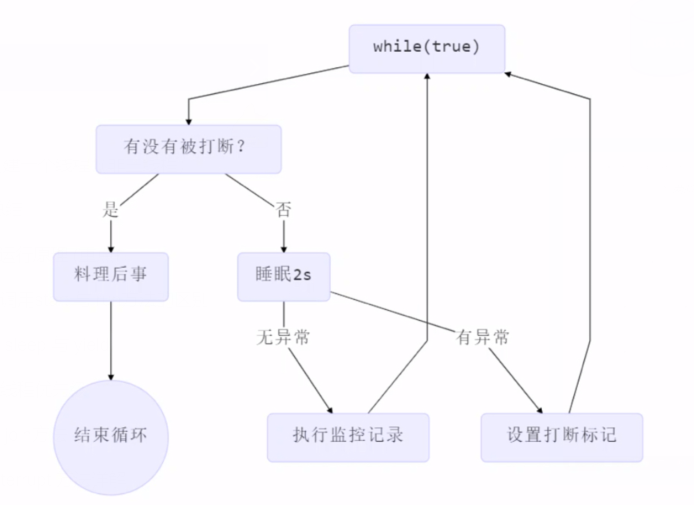

# 多线程设计模式

[TOC]

## 一、两阶段终止模式

### 1.1 目标

在一个线程T1中如何优雅的终止T2？（这里的优雅是指个T2一个料理后事的机会）


### 1.2 错误思路

+ 使用线程对象的stop()方法停止线程
  + stop方法会真正的杀死线程，如果这时线程锁住了共享资源，那么它被杀死后就再也没有机会释放锁，其他线程将永远无法获取锁
+ 使用System.exit(int)方法停止线程
  + 目标仅仅是停止一个线程，但这种做法会让整个程序都停止


### 1.3 正确思路




```java
@Slf4j
public class TwoPhaseTermination {

    private Thread monitor;

    public void start() {
        monitor = new Thread(() -> {
            while (true) {
                Thread currentThread = Thread.currentThread();
                if (currentThread.isInterrupted()) {
                    log.debug("料理后事");
                    break;
                }

                try {
                    Thread.sleep(1000);
                    log.debug("执行监控记录");
                } catch (InterruptedException e) {
                    // sleep被打断会将标志设置为false，这里需要重新设置打断标志
                    currentThread.interrupt();
                    e.printStackTrace();
                }
            }
        });

        monitor.start();
    }

    public void stop() {
        monitor.interrupt();
    }

    public static void main(String[] args) throws InterruptedException {
        TwoPhaseTermination twoPhaseTermination = new TwoPhaseTermination();
        twoPhaseTermination.start();

        Thread.sleep(3500);
        twoPhaseTermination.stop();
    }
}
```


## 二、同步模式之保护性暂停 (`join、Future的实现`)

### 2.1 概述

即Guarded Suspension，用在一个线程等待另一个线程的执行结果

- 有一个结果需要从一个线程传递到另一个线程，让他们关联同一个 GuardedObject
- 如果有结果不断从一个线程到另一个线程那么可以使用消息队列（见生产者/消费者）
- JDK 中，join 的实现、Future 的实现，采用的就是此模式

- 因为要等待另一方的结果，因此归类到同步模式


### 2.2 扩展1


- 一方等待另一方的执行结果举例 :
- 举例, 线程1等待线程2下载的结果,并获取该结果

```java
/**
 * Description: 多线程同步模式 - 一个线程需要等待另一个线程的执行结果
 *
 * @author guizy1
 * @date 2020/12/21 14:51
 */
@Slf4j(topic = "guizy.GuardeObjectTest")
public class GuardeObjectTest {
    public static void main(String[] args) {
        // 线程1等待线程2的下载结果
        GuardeObject guardeObject = new GuardeObject();
        new Thread(() -> {
            log.debug("等待结果");
            List<String> list = (List<String>) guardeObject.get();
            log.debug("结果大小:{}", list.size());
        }, "t1").start();

        new Thread(() -> {
            log.debug("执行下载");
            try {
                List<String> list = Downloader.download();
                guardeObject.complete(list);
            } catch (IOException e) {
                e.printStackTrace();
            }

        }, "t2").start();
    }
}

class GuardeObject {
    // 结果
    private Object response;

    // 获取结果
    public Object get() {
        synchronized (this) {
            // 防止虚假唤醒
            // 没有结果
            while (response == null) {
                try {
                    this.wait();
                } catch (InterruptedException e) {
                    e.printStackTrace();
                }
            }
            return response;
        }
    }

    // 产生结果
    public void complete(Object response) {
        synchronized (this) {
            // 给结果变量赋值
            this.response = response;
            this.notifyAll();
        }
    }
}
```

- 线程t1等待线程t2的结果，可以设置超时时间， 如果超过时间还没返回结果，此时就不等了退出while循环

```java
@Slf4j(topic = "guizy.GuardeObjectTest")
public class GuardeObjectTest {
    public static void main(String[] args) {
        // 线程1等待线程2的下载结果
        GuardeObject guardeObject = new GuardeObject();
        new Thread(() -> {
            log.debug("begin");
            Object obj = guardeObject.get(2000);
            log.debug("结果是:{}", obj);
        }, "t1").start();

        new Thread(() -> {
            log.debug("begin");
            // Sleeper.sleep(1); // 在等待时间内
            Sleeper.sleep(3);
            guardeObject.complete(new Object());
        }, "t2").start();
    }
}

class GuardeObject {
    // 结果
    private Object response;

    // 获取结果
    // timeout表示等待多久. 这里假如是2s
    public Object get(long timeout) {
        synchronized (this) {
            // 假如开始时间为 15:00:00
            long begin = System.currentTimeMillis();
            // 经历的时间
            long passedTime = 0;
            while (response == null) {
                // 这一轮循环应该等待的时间
                long waitTime = timeout - passedTime;
                // 经历的时间超过了最大等待时间, 退出循环
                if (waitTime <= 0) {
                    break;
                }
                try {
                    // this.wait(timeout)的问题: 虚假唤醒在15:00:01的时候,此时response还null, 此时经历时间就为1s,
                    // 进入while循环的时候response还是空,此时判断1s<=timeout 2s,此时再次this.wait(2s)吗,此时已经经历了
                    // 1s,所以只要再等1s就可以了. 所以等待的时间应该是 超时时间(timeout) - 经历的时间(passedTime)
                    this.wait(waitTime);
                } catch (InterruptedException e) {
                    e.printStackTrace();
                }
                // 经历时间
                passedTime = System.currentTimeMillis() - begin; // 15:00:02
            }
            return response;
        }
    }

    // 产生结果
    public void complete(Object response) {
        synchronized (this) {
            // 给结果变量赋值
            this.response = response;
            this.notifyAll();
    }
}
    
// 在等待时间内的情况
16:20:41.627 guizy.GuardeObjectTest [t1] - begin
16:20:41.627 guizy.GuardeObjectTest [t2] - begin
16:20:42.633 guizy.GuardeObjectTest [t1] - 结果是:java.lang.Object@1e1d0168

// 超时的情况
16:21:24.663 guizy.GuardeObjectTest [t2] - begin
16:21:24.663 guizy.GuardeObjectTest [t1] - begin
16:21:26.667 guizy.GuardeObjectTest [t1] - 结果是:null
```

- 关于超时的增强，在`join(long millis) 的源码`中得到了体现：

```java
public final synchronized void join(long millis)
throws InterruptedException {
    long base = System.currentTimeMillis();
    long now = 0;

    if (millis < 0) {
        throw new IllegalArgumentException("timeout value is negative");
    }

    if (millis == 0) {
        while (isAlive()) {
            wait(0);
        }
    } else {
    // join一个指定的时间
        while (isAlive()) {
            long delay = millis - now;
            if (delay <= 0) {
                break;
            }
            wait(delay);
            now = System.currentTimeMillis() - base;
        }
    }
}
```


### 2.3 扩展2

多任务版`GuardedObject`图中 `Futures` 就好比居民楼一层的信箱（每个信箱有房间编号），左侧的 t0，t2，t4 就好比等待邮件的居民，右侧的 t1，t3，t5 就好比邮递员如果需要在多个类之间使用 GuardedObject 对象，作为参数传递不是很方便，因此设计一个用来解耦的中间类。

- 不仅能够解耦结果等待者和结果生产者，还能够同时支持多个任务的管理。和生产者消费者模式的区别就是：**这个产生结果的线程和使用结果的线程是一一对应的关系，但是生产者消费者模式并不是。**
- rpc框架的调用中就使用到了这种模式。


```java
/**
 * Description: 同步模式保护性暂停模式 (多任务版)
 *
 * @author guizy1
 * @date 2020/12/21 14:51
 */
@Slf4j(topic = "guizy.GuardedObjectTest")
public class GuardedObjectTest {
    public static void main(String[] args) {
        for (int i = 0; i < 3; i++) {
            new People().start();
        }
        Sleeper.sleep(1);
        for (Integer id : Mailboxes.getIds()) {
            new Postman(id, "内容" + id).start();
        }
    }
}

@Slf4j(topic = "guizy.People")
class People extends Thread {
    @Override
    public void run() {
        // 收信
        GuardedObject guardedObject = Mailboxes.createGuardedObject();
        log.debug("开始收信 id:{}", guardedObject.getId());
        Object mail = guardedObject.get(5000);
        log.debug("收到信 id:{}, 内容:{}", guardedObject.getId(), mail);
    }
}

@Slf4j(topic = "guizy.Postman")
// 邮寄员类
class Postman extends Thread {
    private int id;
    private String mail;

    public Postman(int id, String mail) {
        this.id = id;
        this.mail = mail;
    }

    @Override
    public void run() {
        GuardedObject guardedObject = Mailboxes.getGuardedObject(id);
        log.debug("送信 id:{}, 内容:{}", id, mail);
        guardedObject.complete(mail);
    }
}

// 信箱类
class Mailboxes {
    private static Map<Integer, GuardedObject> boxes = new Hashtable<>();

    private static int id = 1;

    // 产生唯一 id
    private static synchronized int generateId() {
        return id++;
    }

    public static GuardedObject getGuardedObject(int id) {
        //根据id获取到box并删除对应的key和value,避免堆内存爆了
        return boxes.remove(id);
    }

    public static GuardedObject createGuardedObject() {
        GuardedObject go = new GuardedObject(generateId());
        boxes.put(go.getId(), go);
        return go;
    }

    public static Set<Integer> getIds() {
        return boxes.keySet();
    }
}

// 用来传递信息的作用, 当多个类使用GuardedObject,就很不方便,此时需要一个设计一个解耦的中间类
class GuardedObject {
    // 标记GuardedObject
    private int id;
    // 结果
    private Object response;

    public int getId() {
        return id;
    }

    public GuardedObject(int id) {
        this.id = id;
    }

    // 获取结果
    // timeout表示等待多久. 这里假如是2s
    public Object get(long timeout) {
        synchronized (this) {
            // 假如开始时间为 15:00:00
            long begin = System.currentTimeMillis();
            // 经历的时间
            long passedTime = 0;
            while (response == null) {
                // 这一轮循环应该等待的时间
                long waitTime = timeout - passedTime;
                // 经历的时间超过了最大等待时间, 退出循环
                if (waitTime <= 0) {
                    break;
                }
                try {
                    // this.wait(timeout)的问题: 虚假唤醒在15:00:01的时候,此时response还null, 此时经历时间就为1s,
                    // 进入while循环的时候response还是空,此时判断1s<=timeout 2s,此时再次this.wait(2s)吗,此时已经经历了
                    // 1s,所以只要再等1s就可以了. 所以等待的时间应该是 超时时间(timeout) - 经历的时间(passedTime)
                    this.wait(waitTime);
                } catch (InterruptedException e) {
                    e.printStackTrace();
                }
                // 经历时间
                passedTime = System.currentTimeMillis() - begin; // 15:00:02
            }
            return response;
        }
    }

    // 产生结果
    public void complete(Object response) {
        synchronized (this) {
            // 给结果变量赋值
            this.response = response;
            this.notifyAll();
        }
    }
}
```

## 三、异步模式之生产者/消费者 

与前面的保护性暂停中的GuardedObject不同，不需要产生结果和消费结果的线程一一对应 (一个生产一个消费)

- 消费队列可以用来平衡生产和消费的线程资源
- 生产者仅负责产生结果数据，不关心数据该如何处理，而消费者专心处理结果数据
- 消息队列是有容量限制的，满时不会再加入数据，空时不会再消耗数据
- JDK 中各种阻塞队列，采用的就是这种模式

异步模式中, 生产者产生消息之后消息没有被立刻消费
同步模式中, 消息在产生之后被立刻消费了。


- 我们下面写的小例子是`线程间通信`的`消息队列`，要注意区别,像`RabbitMQ`等消息框架是`进程间通信`的。

```java
/**
 * Description: 异步模式之生产者/消费者
 *
 * @author guizy1
 * @date 2020/12/21 18:23
 */
@Slf4j(topic = "giuzy.ProductConsumerTest")
public class ProductConsumerTest {
    public static void main(String[] args) {
        MessageQueue queue = new MessageQueue(2);

        for (int i = 0; i < 3; i++) {
            int id = i;
            new Thread(() -> {
                queue.put(new Message(id, "值" + id));
            }, "生产者" + i).start();
        }

        new Thread(() -> {
            while (true) {
                Sleeper.sleep(1);
                Message message = queue.take();
            }
        }, "消费者").start();
    }

}

// 消息队列类,在线程之间通信
@Slf4j(topic = "guizy.MessageQueue")
class MessageQueue {
    // 消息的队列集合
    private LinkedList<Message> list = new LinkedList<>();
    // 队列容量
    private int capcity;

    public MessageQueue(int capcity) {
        this.capcity = capcity;
    }

    // 获取消息
    public Message take() {
        // 检查队列是否为空
        synchronized (list) {
            while (list.isEmpty()) {
                try {
                    log.debug("队列为空, 消费者线程等待");
                    list.wait();
                } catch (InterruptedException e) {
                    e.printStackTrace();
                }
            }
            // 从队列头部获取消息并返回
            Message message = list.removeFirst();
            log.debug("已消费消息 {}", message);
            list.notifyAll();
            return message;
        }
    }

    // 存入消息
    public void put(Message message) {
        synchronized (list) {
            // 检查对象是否已满
            while (list.size() == capcity) {
                try {
                    log.debug("队列已满, 生产者线程等待");
                    list.wait();
                } catch (InterruptedException e) {
                    e.printStackTrace();
                }
            }
            // 将消息加入队列尾部
            list.addLast(message);
            log.debug("已生产消息 {}", message);
            list.notifyAll();
        }
    }
}

final class Message {
    private int id;
    private Object value;

    public Message(int id, Object value) {
        this.id = id;
        this.value = value;
    }

    public int getId() {
        return id;
    }

    public Object getValue() {
        return value;
    }

    @Override
    public String toString() {
        return "Message{" +
                "id=" + id +
                ", value=" + value +
                '}';
    }
}
```
运行结果
```java
18:52:53.440 guizy.MessageQueue [生产者1] - 已生产消息 Message{id=1, value=值1}
18:52:53.443 guizy.MessageQueue [生产者0] - 已生产消息 Message{id=0, value=值0}
18:52:53.444 guizy.MessageQueue [生产者2] - 队列已满, 生产者线程等待
18:52:54.439 guizy.MessageQueue [消费者] - 已消费消息 Message{id=1, value=值1}
18:52:54.439 guizy.MessageQueue [生产者2] - 已生产消息 Message{id=2, value=值2}
18:52:55.439 guizy.MessageQueue [消费者] - 已消费消息 Message{id=0, value=值0}
18:52:56.440 guizy.MessageQueue [消费者] - 已消费消息 Message{id=2, value=值2}
18:52:57.441 guizy.MessageQueue [消费者] - 队列为空, 消费者线程等待
```

## 四、同步模式之顺序控制 (案例)

### 4.1 先后打印

- 假如有两个线程, 线程A打印1, 线程B打印2.
- 要求: **程序先打印2, 再打印1**

#### 4.1.1 Wait/Notify版本实现

```java
/**
 * Description: 使用wait/notify来实现顺序打印 2, 1
 *
 * @author guizy1
 * @date 2020/12/23 16:04
 */
@Slf4j(topic = "guizy.SyncPrintWaitTest")
public class SyncPrintWaitTest {

    public static final Object lock = new Object();
    // t2线程释放执行过
    public static boolean t2Runned = false;

    public static void main(String[] args) {
        Thread t1 = new Thread(() -> {
            synchronized (lock) {
                while (!t2Runned) {
                    try {
                    	// 进入等待(waitset), 会释放锁
                        lock.wait();
                    } catch (InterruptedException e) {
                        e.printStackTrace();
                    }
                }
                log.debug("1");
            }
        }, "t1");

        Thread t2 = new Thread(() -> {
            synchronized (lock) {
                log.debug("2");
                t2Runned = true;
                lock.notify();
            }
        }, "t2");

        t1.start();
        t2.start();
    }
}
```

#### 4.1.2 使用ReentrantLock的await/signal

```java
/**
 * Description: 使用ReentrantLock的await/sinal 来实现顺序打印 2, 1
 *
 * @author guizy1
 * @date 2020/12/23 16:04
 */
@Slf4j(topic = "guizy.SyncPrintWaitTest")
public class SyncPrintWaitTest {

    public static final ReentrantLock lock = new ReentrantLock();
    public static Condition condition = lock.newCondition();
    // t2线程释放执行过
    public static boolean t2Runned = false;

    public static void main(String[] args) {
        Thread t1 = new Thread(() -> {
            lock.lock();
            try {
                // 临界区
                while (!t2Runned) {
                    try {
                        condition.await();
                    } catch (InterruptedException e) {
                        e.printStackTrace();
                    }
                }
                log.debug("1");
            } finally {
                lock.unlock();
            }
        }, "t1");

        Thread t2 = new Thread(() -> {
            lock.lock();
            try {
                log.debug("2");
                t2Runned = true;
                condition.signal();
            } finally {
                lock.unlock();
            }
        }, "t2");

        t1.start();
        t2.start();
    }
}
```

#### 4.1.3 使用LockSupport中的park/unpart

```java
/**
 * Description: 使用LockSupport中的park,unpark来实现, 顺序打印 2, 1
 *
 * @author guizy1
 * @date 2020/12/23 16:04
 */
@Slf4j(topic = "guizy.SyncPrintWaitTest")
public class SyncPrintWaitTest {
    public static void main(String[] args) {
        Thread t1 = new Thread(() -> {
            LockSupport.park();
            log.debug("1");
        }, "t1");
        t1.start();

        new Thread(() -> {
            log.debug("2");
            LockSupport.unpark(t1);
        }, "t2").start();
    }
}

16:10:28.592 guizy.SyncPrintWaitTest [t2] - 2
16:10:28.595 guizy.SyncPrintWaitTest [t1] - 1
```

### 4.2 交替输出

需求
- **线程1 输出 a 5次, 线程2 输出 b 5次, 线程3 输出 c 5次。现在要求输出 abcabcabcabcabcabc**

#### 4.2.1 wait/notify版本

```java
/**
 * Description: 使用wait/notify来实现三个线程交替打印abcabcabcabcabc
 *
 * @author guizy1
 * @date 2020/12/23 17:00
 */
@Slf4j(topic = "guizy.TestWaitNotify")
public class TestWaitNotify {
    public static void main(String[] args) {
        WaitNotify waitNotify = new WaitNotify(1, 5);

        new Thread(() -> {
            waitNotify.print("a", 1, 2);

        }, "a线程").start();

        new Thread(() -> {
            waitNotify.print("b", 2, 3);

        }, "b线程").start();

        new Thread(() -> {
            waitNotify.print("c", 3, 1);

        }, "c线程").start();
    }
}

@Slf4j(topic = "guizy.WaitNotify")
@Data
@AllArgsConstructor
class WaitNotify {

    private int flag;
    
    // 循环次数
    private int loopNumber;

    /*
        输出内容    等待标记    下一个标记
        a           1          2
        b           2          3
        c           3          1
     */
    public void print(String str, int waitFlag, int nextFlag) {
        for (int i = 0; i < loopNumber; i++) {
            synchronized (this) {
                while (waitFlag != this.flag) {
                    try {
                        this.wait();
                    } catch (InterruptedException e) {
                        e.printStackTrace();
                    }
                }
                System.out.print(str);
                this.flag = nextFlag;
                this.notifyAll();
            }
        }
    }
}
```

#### 4.2.2、await/signal版本

```java
/**
 * Description: 使用await/signal来实现三个线程交替打印abcabcabcabcabc
 *
 * @author guizy1
 * @date 2020/12/23 17:10
 */
@Slf4j(topic = "guizy.TestWaitNotify")
public class TestAwaitSignal {
    public static void main(String[] args) throws InterruptedException {
        AwaitSignal awaitSignal = new AwaitSignal(5);
        Condition a_condition = awaitSignal.newCondition();
        Condition b_condition = awaitSignal.newCondition();
        Condition c_condition = awaitSignal.newCondition();

        new Thread(() -> {
            awaitSignal.print("a", a_condition, b_condition);
        }, "a").start();

        new Thread(() -> {
            awaitSignal.print("b", b_condition, c_condition);
        }, "b").start();

        new Thread(() -> {
            awaitSignal.print("c", c_condition, a_condition);
        }, "c").start();

        Thread.sleep(1000);
        System.out.println("==========开始=========");
        awaitSignal.lock();
        try {
            a_condition.signal();  //首先唤醒a线程
        } finally {
            awaitSignal.unlock();
        }
    }
}

class AwaitSignal extends ReentrantLock {
    private final int loopNumber;

    public AwaitSignal(int loopNumber) {
        this.loopNumber = loopNumber;
    }

    public void print(String str, Condition condition, Condition next) {
        for (int i = 0; i < loopNumber; i++) {
            lock();
            try {
                try {
                    condition.await();
                    //System.out.print("i:==="+i);
                    System.out.print(str);
                    next.signal();
                } catch (InterruptedException e) {
                    e.printStackTrace();
                }
            } finally {
                unlock();
            }
        }
    }
}
```

#### 4.2.3 LockSupport的park/unpark实现

```java
/**
 * Description: 使用park/unpark来实现三个线程交替打印abcabcabcabcabc
 *
 * @author guizy1
 * @date 2020/12/23 17:12
 */
@Slf4j(topic = "guizy.TestWaitNotify")
public class TestParkUnpark {
    static Thread a;
    static Thread b;
    static Thread c;

    public static void main(String[] args) {
        ParkUnpark parkUnpark = new ParkUnpark(5);

        a = new Thread(() -> {
            parkUnpark.print("a", b);
        }, "a");

        b = new Thread(() -> {
            parkUnpark.print("b", c);
        }, "b");

        c = new Thread(() -> {
            parkUnpark.print("c", a);
        }, "c");

        a.start();
        b.start();
        c.start();

        LockSupport.unpark(a);

    }
}

class ParkUnpark {
    private final int loopNumber;

    public ParkUnpark(int loopNumber) {
        this.loopNumber = loopNumber;
    }

    public void print(String str, Thread nextThread) {
        for (int i = 0; i < loopNumber; i++) {
            LockSupport.park();
            System.out.print(str);
            LockSupport.unpark(nextThread);
        }
    }
}
```
