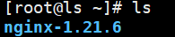
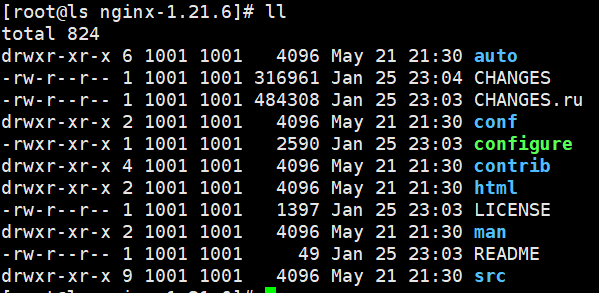
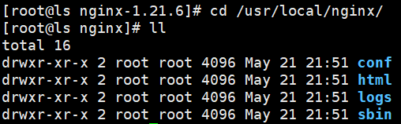
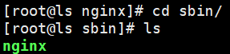
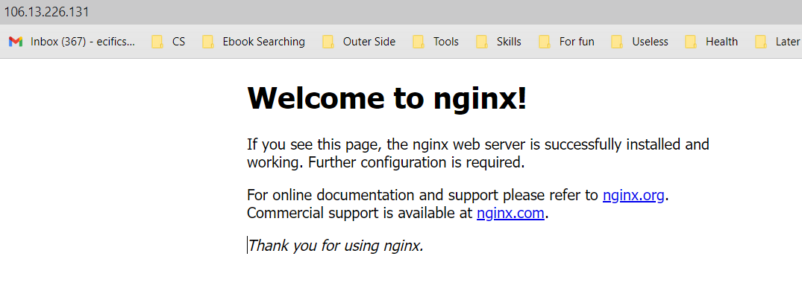
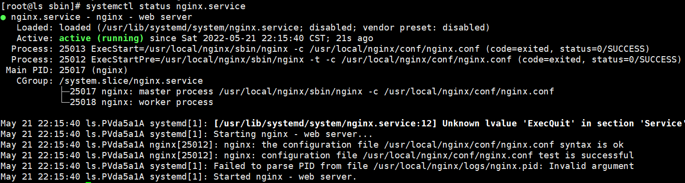
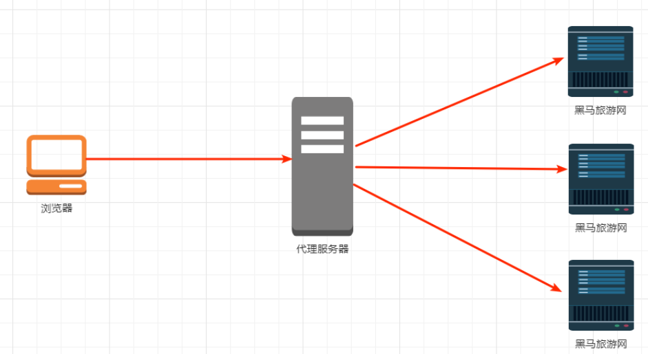

# Nginx


## 一、Nginx的安装与初步使用

### 1.1 Nginx安装

Nginx下载地址 [Nginx Download Page](http://nginx.org/en/download.html)，下载对应的文件

将文件传入linux服务器/root目录下，通过`tar -zxvf`命令将其解压



然后进入解压后的文件夹




可以通过 `./configure --prefix=/usr/local/nginx` 编译安装并将其安装在`/usr/local`目录下，但是在这之前有3样东西需要准备前

+ gcc（可以通过`yum install -y gcc`来安装）

+ perl库（通过`yum install -y pcre pcre-devel`命令来安装）

+ zlib库（通过`yum install -y zlib zlib-devel`命令来安装）

接下来执行`make`和`make install`命令进行编译安装

安装后的nginx目录




### 1.2 Nginx启动

进入/usr/local/nginx目录下的sbin目录，然后输入`./nginx`命令后启动nginx服务器



如果想访问到相关页面，需要关闭防火墙`systemctl stop firewalld.service`也可以开放外网端口`firewall-cmd --zone=public --add-port=80/tcp --permanent`（命令执行完成之后需要重启防火墙才能生效`systemctl restart firewalld.service`）

>注：如果采用开放端口的方式，可以通过`firewall-cmd --list-ports`命令来查看当前开放了哪些端口

然后输入服务器的ip地址，就可以看见`Welcome to nginx!`



nginx重启或者停止命令

```shell
./nginx 			启动
./nginx -v 			查看nginx版本号
./nginx -s stop 	快速停止
./nginx -s quit 	优雅关闭，在退出前完成已经接受的连接请求
./nginx -s reload 	重新加载配置（修改了配置文件后，不需要重启nginx服务器重新加载配置文件，热部署）
```


### 1.3 创建启动脚本

通过脚本文件可以快速启动nginx而不需要到对应的目录下面去执行命令开启

通过命令`vi /usr/lib/systemd/system/nginx.service`在相应文件夹下面创建脚本文件

```shell
[Unit]
Description=nginx - web server
After=network.target remote-fs.target nss-lookup.target

[Service]
Type=forking
PIDFile=/usr/local/nginx/logs/nginx.pid
ExecStartPre=/usr/local/nginx/sbin/nginx -t -c /usr/local/nginx/conf/nginx.conf
ExecStart=/usr/local/nginx/sbin/nginx -c /usr/local/nginx/conf/nginx.conf
ExecReload=/usr/local/nginx/sbin/nginx -s reload
ExecStop=/usr/local/nginx/sbin/nginx -s stop
ExecQuit=/usr/local/nginx/sbin/nginx -s quit
PrivateTmp=true

[Install]
WantedBy=multi-user.target
```

重新加载系统服务

```
systemctl daemon-reload
```

启动服务 （在启动服务之前如果nginx还在运行，可以通过上面nginx暂停命令将其暂停）

```shell
systemctl start nginx.service
```


查看服务状态

```shell
systemctl status nginx.service
```




 开机启动 

```shell
systemctl enable nginx.service
```


## 二、正向代理、反向代理、负载均衡和动静分离

### 2.1 正向代理

如果把局域网外的Internet想象成一个巨大的资源库，那么局域网中的客户端要访问Internet，则需要通过代理服务来访问，这种代理访问叫做正向代理

例如通过客户端（浏览器）访问Google需要代理服务器，在客户端（浏览器）这边需要配置好代理服务器，然后通过代理服务器来访问Google


### 2.2 反向代理

反向代理，客户端不需要配置就可以访问，我们只需要将请求发送到反向代理服务器，由反向代理服务器去选择目标服务器获取数据后，再返回给客户端，此时反向代理服务器和目标服务器对外就是一个服务器，暴露的是代理服务器地址，隐藏了真实服务器地址




### 2.3 负载均衡

当访问量十分大的时候，单个服务器无法解决，我们可以增加服务器的数量，将请求平均分发到各个服务器上，将原先请求集中到单个服务器的情况改为请求分发到多个服务器上，就是**负载均衡**


### 2.4 动静分离

为了加快网站的解析速度，可以把动态页面和静态页面由不同的服务器来解析，加快解析速度，降低原来单个服务器的压力


## 三、Nginx配置文件

### 3.1 配置文件内容

位置`/usr/local/nginx/conf/nginx.conf`其实#后面的是注释，下面内容中已经将注释删除掉了

```
worker_processes  1;

events {
    worker_connections  1024;
}

http {
    include       mime.types;
    default_type  application/octet-stream;

    sendfile        on;
    
    keepalive_timeout  65;

    server {
        listen       80;
        server_name  localhost;

        location / {
            root   html;
            index  index.html index.htm;
        }
        
        error_page   500 502 503 504  /50x.html;
        location = /50x.html {
            root   html;
        }
    }   

}
```


### 3.2 配置文件组成

#### （1）全局块

从配置文件开始到`events`之间的内容

主要设置一些会影响nginx服务器整体运行的配置指令吗，主要包括配置运行nginx服务器的用户组、允许生成的worker process数，进程PID存放路径、日志存放路径和类型以及配置文件的引入等

对应上面配置文件中的

```
worker_processes  1;
```

表示nginx服务器并发处理服务的关键配置，worker_processes越大，可支持的并发处理量越多（但是数量不要超过服务器具体的内核数，否则没有意义）

#### （2）events块

涉及的指令主要影响nginx服务器与用户的网络连接，常用的设置包括开启对多 work_process 下的网络连接进行序列化，是否允许同时接收多个网络连接，选取哪种事件驱动模型来处理连接请求，每个worker_process可以同时支持的最大连接数等

```
events {
    worker_connections  1024;
}
```

表示 每个worker_process 支持的最大连接数为 1024

这部分配置对Nginx的影响最大

#### （3）http块

这算是 Nginx 服务器配置中最频繁的部分，代理、缓存和日志定义等绝大多数功能和第三方模块的配置都在这里。 需要注意的是：http 块也可以包括 http 全局块、server 块。

```
http {
    include       mime.types;
    default_type  application/octet-stream;

    sendfile        on;
    
    keepalive_timeout  65;

    server {
        listen       80;
        server_name  localhost;

        location / {
            root   html;
            index  index.html index.htm;
        }
        
        error_page   500 502 503 504  /50x.html;
        location = /50x.html {
            root   html;
        }
    }   

}
```


+ http 全局块 
  + http 全局块配置的指令包括文件引入、MIME-TYPE 定义、日志自定义、连接超时时间、单链接请求数上限等。
+ server 块 
  + 这块和虚拟主机有密切关系，虚拟主机从用户角度看，和一台独立的硬件主机是完全一样的，该技术的产生是为了 节省互联网服务器硬件成本。 
  + 每个 http 块可以包括多个 server 块，而每个 server 块就相当于一个虚拟主机。 
  + 而每个 server 块也分为全局 server 块，以及可以同时包含多个 locaton 块。 
    + 全局 server 块 
      + 最常见的配置是本虚拟机主机的监听配置和本虚拟主机的名称或 IP 配置。 
    + location 块 
      + 一个 server 块可以配置多个 location 块。 
      + 这块的主要作用是基于 Nginx 服务器接收到的请求字符串（例如 server_name/uri-string），对虚拟主机名称 （也可以是 IP 别名）之外的字符串（例如 前面的 /uri-string）进行匹配，对特定的请求进行处理。地址定向、数据缓 存和应答控制等功能，还有许多第三方模块的配置也在这里进行。


## 四、反向代理实例1

### 4.1 实现效果

打开浏览器，在浏览器地址栏输入www.123.com，跳转到 liunx 系统 tomcat 主页面中 


### 4.2 准备工作 

+ 准备tomcat

  + 在 liunx 系统安装 tomcat，使用默认端口 8080 * 

  + tomcat 安装文件放到 liunx 系统中，解压 

  + 进入 tomcat 的 bin 目录中，./startup.sh 启动 tomcat 服务器

+ 对外开放访问的端口 
  + `firewall-cmd --add-port=8080/tcp --permanent `
  + `systemctl restart firewalld.service` 重启防火墙使配置生效
  + 查看已经开放的端口号 `firewall-cmd --list-all`


>注：运行tomcat需要有jdk环境
>
>+ 去官网下载安装包`jdk-8u202-linux-x64.rpm`，然后传到linux下/opt/目录
>
>+ 运行`sudo yum install -y jdk-8u202-linux-x64.rpm `命令
>
>+ 更改配置文件，`vim /etc/profile`，在最后面加上（第一行名字和具体的jdk安装包名字对应）
>
> ```
> export JAVA_HOME=/usr/java/jdk1.8.0_202-amd64
> export PATH=$JAVA_HOME/bin:$PATH
> export CLASSPATH=.:$JAVA_HOME/lib/dt.jar:$JAVA_HOME/lib/tools.jar
> ```
>+ 使配置生效`source /etc/profile`
>+ 查看jdk版本 `java -version`


### 4.3 详细配置

#### （1）在Windows系统中的hosts文件进行域名和ip对应关系的配置

hosts文件文件路径：`‪C:\Windows\System32\drivers\etc\hosts`

在hosts文件末尾加上

```
106.13.226.131 www.123.com
```

此时可以通过 www.123.com的8080端口访问tomcat主页面


#### （2） 在Nginx进行请求转发配置

修改server_name为服务器ip，location中添加proxy_pass属性，当访问80端口时，转发到8080端口

```java
server {
    listen       80;
    server_name  106.13.226.131;

    #charset koi8-r;

    #access_log  logs/host.access.log  main;

    location / {
        root   html;
        proxy_pass http://127.0.0.1:8080;
        index  index.html index.htm;
    }

    ....
}
```

然后重新加载服务器配置`./nginx -s reload`

最后输入www.123.com即可看到tomcat主页（如果显示的是nginx主页可以刷新一下）


## 五、反向代理实例2

### 5.1 实现效果

使用nginx反向代理，根据访问的路径跳转到不同端口的服务中，nginx监听端口为9001

例如 访问 http://127.0.0.1:9001/edu/ 直接跳转到 127.0.0.1:8080 端口

​		 访问 http://127.0.0.1:9001/vod/ 直接跳转到 127.0.0.1:8081 端口


### 5.2 准备工作

+ 准备两个服务器，一个8080端口，一个8081端口，第二个服务器需要修改conf目录下 server.xml 文件中**所有**端口号
+ 创建页面文件
  + 在8080端口对应的tomcat/webapps/目录下创建文件夹edu，在这个文件夹中放上相应的页面a.html，可以通过 http://106.13.226.131:8080/edu/a.html 访问
  + 在8081端口对应的tomcat/webapps/目录下创建文件夹vod，在这个文件夹下放入页面a.html，可以通过 http://106.13.226.131:8081/vod/a.html 访问


### 5.3 具体配置

找到nginx配置文件nginx.con，加入server块

```java
server {
    listen          9001;
    server_name     106.13.226.131;

    location ~ /edu/ {
        proxy_pass  http://106.13.226.131:8080;
    }

    location ~ /vod/ {
        proxy_pass  http://106.13.226.131:8081;
    }
}
```

其中location后面`~ /edu/`是正则表达式，表示url中含有edu的请求，其中listen表示监听的端口号