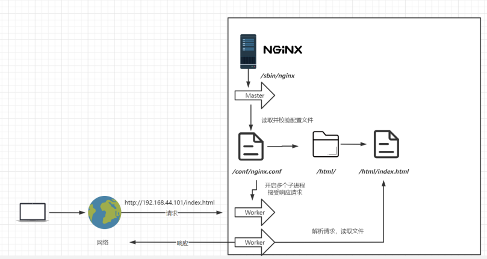

# Nginx


## 一、Nginx的安装与初步使用

### 1.1 Nginx安装

Nginx下载地址 [Nginx Download Page](http://nginx.org/en/download.html)，下载对应的文件

将文件传入linux服务器/root目录下，通过`tar -zxvf`命令将其解压


然后进入解压后的文件夹


可以通过 `./configure --prefix=/usr/local/nginx` 编译安装并将其安装在`/usr/local`目录下，但是在这之前有3样东西需要准备前

+ gcc（可以通过`yum install -y gcc`来安装）

+ perl库（通过`yum install -y pcre pcre-devel`命令来安装）

+ zlib库（通过`yum install -y zlib zlib-devel`命令来安装）

接下来执行`make`和`make install`命令进行编译安装

安装后的nginx目录


### 1.2 Nginx启动

进入/usr/local/nginx目录下的sbin目录，然后输入`./nginx`命令后启动nginx服务器


如果想访问到相关页面，需要关闭防火墙`systemctl stop firewalld.service`也可以开放外网端口`firewall-cmd --zone=public --add-port=80/tcp --permanent`（命令执行完成之后需要重启防火墙才能生效`systemctl restart firewalld.service`）

>注：如果采用开放端口的方式，可以通过`firewall-cmd --list-ports`命令来查看当前开放了哪些端口

然后输入服务器的ip地址，就可以看见`Welcome to nginx!`


nginx重启或者停止命令

```shell
./nginx 			启动
./nginx -s stop 	快速停止
./nginx -s quit 	优雅关闭，在退出前完成已经接受的连接请求
./nginx -s reload 	重新加载配置（不需要重启nginx服务器，热部署）
```


### 1.3 创建启动脚本

通过脚本文件可以快速启动nginx而不需要到对应的目录下面去执行命令开启

通过命令`vi /usr/lib/systemd/system/nginx.service`在相应文件夹下面创建脚本文件

```shell
[Unit]
Description=nginx - web server
After=network.target remote-fs.target nss-lookup.target

[Service]
Type=forking
PIDFile=/usr/local/nginx/logs/nginx.pid
ExecStartPre=/usr/local/nginx/sbin/nginx -t -c /usr/local/nginx/conf/nginx.conf
ExecStart=/usr/local/nginx/sbin/nginx -c /usr/local/nginx/conf/nginx.conf
ExecReload=/usr/local/nginx/sbin/nginx -s reload
ExecStop=/usr/local/nginx/sbin/nginx -s stop
ExecQuit=/usr/local/nginx/sbin/nginx -s quit
PrivateTmp=true

[Install]
WantedBy=multi-user.target
```

重新加载系统服务

```
systemctl daemon-reload
```

启动服务 （在启动服务之前如果nginx还在运行，可以通过上面nginx暂停命令将其暂停）

```shell
systemctl start nginx.service
```


查看服务状态

```shell
systemctl status nginx.service
```


 开机启动 

```shell
systemctl enable nginx.service
```


## 二、Nginx目录结构以及运行原理

### 2.1 目录结构


+ conf 
  + 用来存放配置文件相关 
+ html 
  + 用来存放静态文件的默认目录 html、css等 
+ logs
  + 用来存放日志文件

+ sbin 
  + nginx的主程序


### 2.2 运行原理



启动nginx后，主进程master读取并校验配置文件，开启多个子进程worker来相应用户的请求